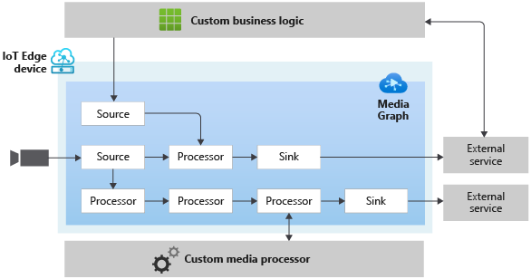

# Media Graph

Media Graph lets you define where media should be captured from, how it should be processed, and where the results should be delivered. You accomplish this by connecting components, or nodes, in the desired manner. The diagram below provides a graphical representation of a Media Graph. 

 

  

 

A Media Graph can have one or more of the following types of nodes:

1. Source node, which represents ingestion of media into the Media Graph. Media in this context, conceptually, could be an audio stream, a video stream, a data stream, or a stream that has audio, video, and/or data combined together in a single stream
2. Processor node, which represents processing of the media within the Media Graph
3. Sink node, which represents delivery of the processing results outside the Media Graph

Live video analytics enables you to manage media graphs via two entities – “Graph Topology” and “Graph Instance”. A Graph Topology enables you to define a blueprint of a Media Graph, with parameters as placeholders for values. This topology defines what nodes are used in the Media Graph, and how they are connected within it. A Graph Instance enables you to provide values for parameters in a Graph Topology. The graph instance can then be activated to enable the flow of data.

You can learn more on the Media Graph concept page
