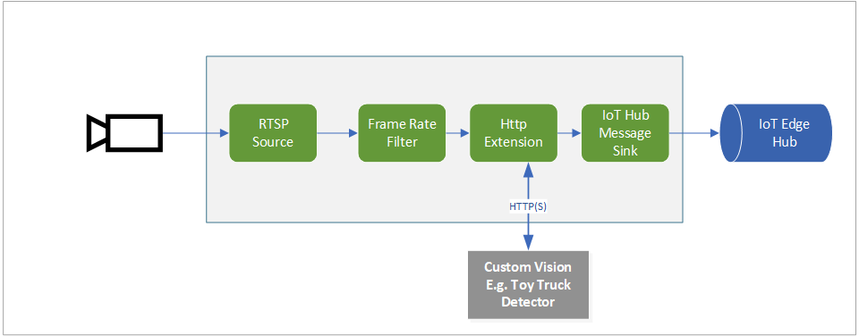

# Analyzing live video using HTTP Extension to send images to an external Azure Custom Vision module 

Azure Custom Vision is an AI service and an end-to-end platform for applying computer vision to your specific scenario. It allows you to create a custom computer vision model in minutes. As a customer, you can customize and embed state-of-the-art computer vision for specific domains without the need for any machine learning expertise.

This topology enables you to run Live Video Analytics with Custom Vision on a video feed from a RTSP-capable camera. A subset of the video frames from the camera (as controlled by the Frame Rate Filter) are converted to images, and sent to an external Custom Vision module. The results are then published to the IoT Hub.

 

  

 