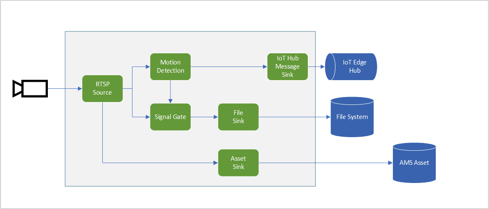

# Continuous video recording and record videos to assets, based on motion events
This topology enables you to capture video from RTSP source and continuously record it to an Azure Media Services asset. You can read more about the continuous video recording scenario in this documentation page.
In addition to recording continous video, the topology also supports detecting motion, relaying such motion detection events to the IoT edge hub as well as recording motion detected events to media assets in the cloud. 

 

  

 