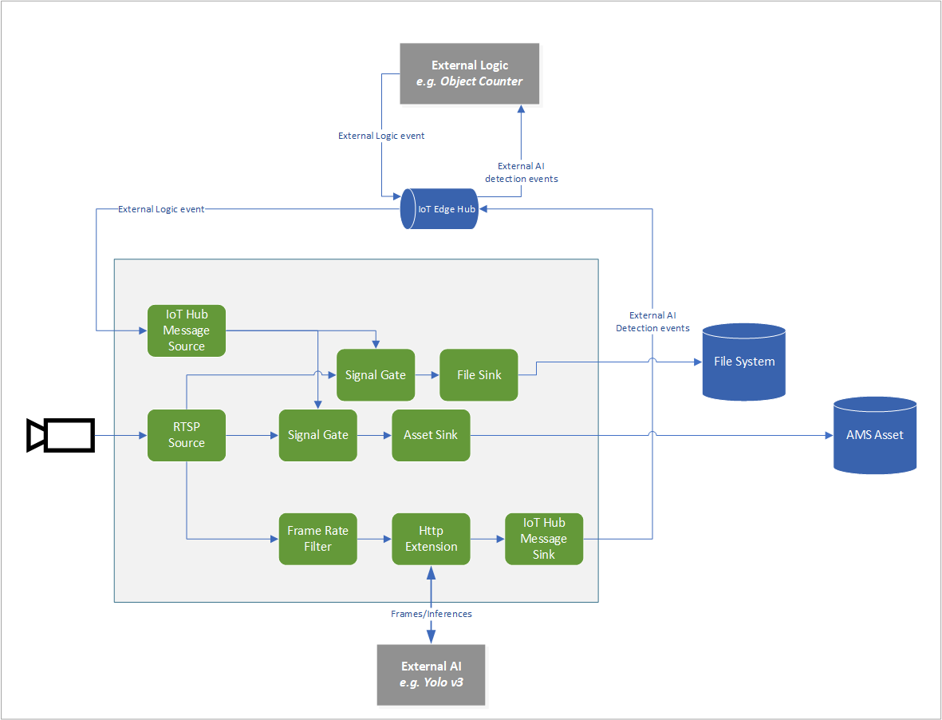

# Record videos to assets and files based on messages via hub source
This topology enables you to extend the Media graph by interfacing it with an External AI module, relaying inference events from the AI to be published onto the Iot Edge Hub. Additonally, an external edge module triggers the graph to record video clips as mp4 files on the edge and media assets in the cloud. The trigger to generate these clips is based on the AI inference events published onto the Hub. You can read more about the continuous video recording scenario in this documentation page.

 

  

 
