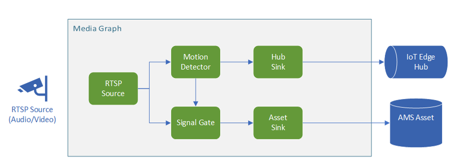

# Record videos to Media Services assets, based on motion events

This topology enables you to record mp4 video clips to your Azure Media Service Assets whenever motion is detected in the video. You can read more about the scenario in this documentation page.

 

  

 