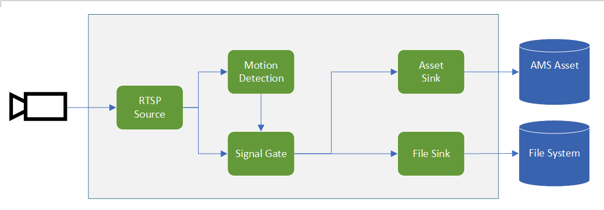

# Event-based video recording to assets and local files based on motion events

This topology enables you perform event-based recording of video clips to the cloud as well as to the edge. The video from an RTSP-capable camera is analyzed for the presence of motion. When motion is detected, events are sent to a signal gate processor node which opens, sending frames to a file sink node as well as an asset sink node. As a result, new files (MP4 format) are created on the local file system of the Edge device, and new assets are created in your Azure Media Service account in the cloud. The recordings contain the frames where motion was detected.

Note: The topology creates new MP4 files each time motion is detected. Over time, this can fill up the local filesystem. You should monitor the contents of the output directory and prune older files as necessary.

Note: This is a modified version of the topology provided [here](https://github.com/Azure/live-video-analytics/tree/master/MediaGraph/topologies/evr-motion-files).
 

  

 
