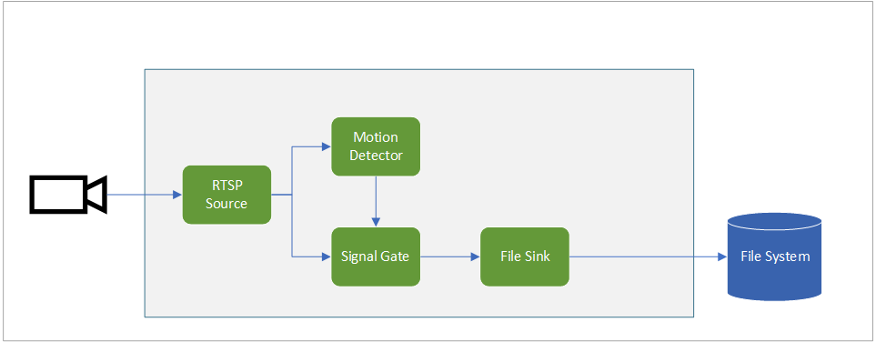

# Record videos to files, based on motion events
This topology enables you to generate mp4 video clips on the edge on a local file system whenever motion is detected in the video. You can read more about the scenario in this documentation page.

 

  

 
