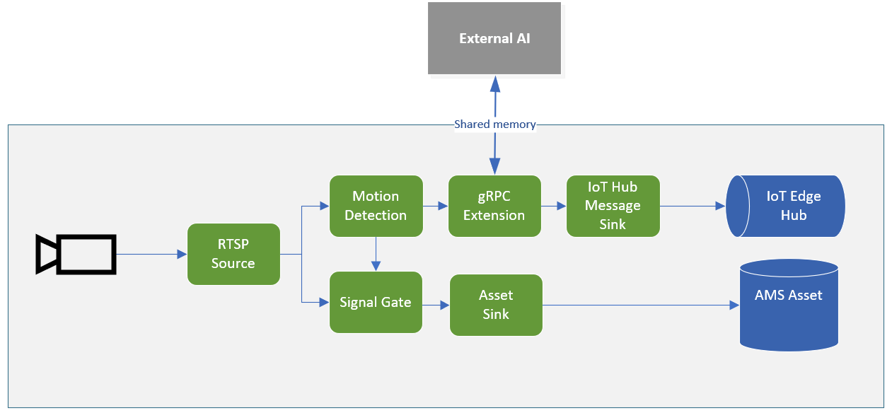

# Event-based video recording to Assets along with inferencing data from external AI using gRPC Extension

This topology enables you perform event-based recording and send inference events from an external AI module using gRPC protocol. The video from an RTSP-capable camera is analyzed for the presence of motion. When motion is detected, those events are used to trigger the signal gate processor node which will send frames to the asset sink node when motion is present. In addition, the video frames are sent to an external AI module through gRPC extension for processing. When an event of interest is detected by the external AI service, those events are published to the IoT Edge Hub.

 

  

 
