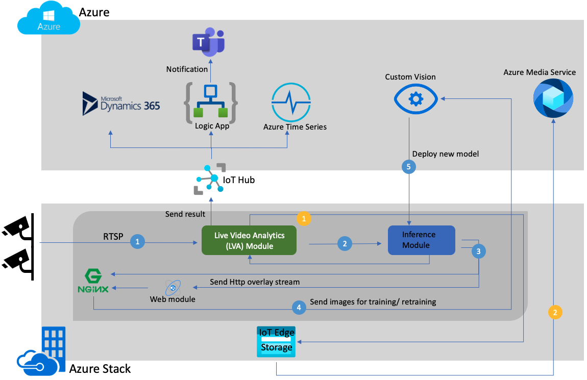

# Vision on Edge for Manufacturing Industry - Powered by Live Video Analytics 

Putting together a video analytics solution on the edge is not a trivial task as one needs variety of skills in video management and analytics, deep learning, edge computing and cloud services. Vision on the Edge for Manufacturing Industry provides an open source implementation of an end-to-end solution that leverages Live Video Analytics on IoT Edge (LVA) along with Custom Vision, Time Series Insights, Logic Apps and Teams notifications to analyze multiple video streams in real time. It describes how to deploy out of the box models onto an Azure Stack Edge (ASE) and scale out this analysis to multiple camera streams via LVA. You will also learn how to leverage Custom Vision to capture images on ASE for continous retraining of the model in the cloud and re-deployment of the model onto multiple cameras on the edge. Finally, it also notifies users via Teams notifications and allows them to understand operational analytics via Time Series Insights. To top it all, it comes packaged in an easy to leverage User Interface which is ideal for customer demos.

Here is the high level architecture diagram of how the solution works with ASE and LVA -

 

## Deploying the Solution Step by Step
A full fledged [step-by-step guide](https://github.com/Azure-Samples/azure-intelligent-edge-patterns/tree/master/factory-ai-vision) is available to learn more about how to use this solution.

## Collaborators
Thanks to Mahesh Yadav, Ricardo Mendes, David Armour and entire Azure Edge Solutions team for building the solutiong with LVA

