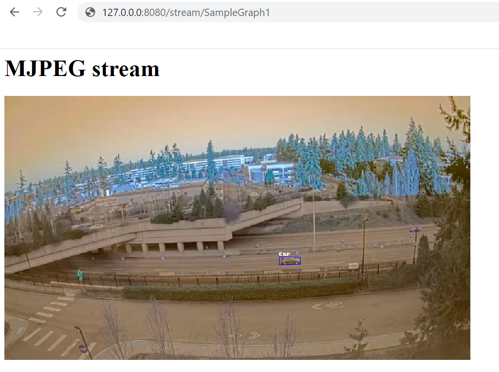

# GStreamer with video analytics plugins from NVIDIA DeepStream

The following instructions will enable you to build a Docker container with a [gRPC](https://grpc.io/) server that can receive messages from LVA on IoT Edge module, and use a [GStreamer](https://gstreamer.freedesktop.org/) pipeline with video analytics plugins from [NVIDIA DeepStream](https://docs.nvidia.com/metropolis/deepstream/dev-guide/index.html) (licensed under MIT license).

Additional open source technologies included are [nginx](https://www.nginx.com/), [gunicorn](https://gunicorn.org/), [flask](https://github.com/pallets/flask), [runit](http://smarden.org/runit/), and [pillow](https://pillow.readthedocs.io/en/stable/index.html).

## Contributions needed

* Improved logging

## Prerequisites

1. [Docker](https://docs.docker.com/docker-for-windows/wsl/) installed on your dev machine.
2. [Visual Studio Code](https://code.visualstudio.com/) with [Azure IoT Tools extension](https://marketplace.visualstudio.com/items?itemName=vsciot-vscode.azure-iot-tools).
3. A device with [IoT Edge runtime](https://docs.microsoft.com/en-us/azure/iot-edge/how-to-install-iot-edge-windows) installed and [registered as an IoT Edge device](https://docs.microsoft.com/en-us/azure/iot-edge/how-to-register-device). You can use a Linux machine or a Windows machine with [WSL2](https://docs.microsoft.com/en-us/windows/wsl/about#what-is-wsl-2) for this purpose.

## Building the container image

Build the container image (should take some minutes) by running the following Docker command from the same directory as this readme file.

```bash
docker build -f ./docker/Dockerfile -t lva-gst-deepstream:latest .
```

## Push image to a container registry

Follow instruction in [Push and Pull Docker images - Azure Container Registry](http://docs.microsoft.com/en-us/azure/container-registry/container-registry-get-started-docker-cli) to save the docker image in Azure Container Registry. Alternatively, you can upload the image to [docker hub](https://hub.docker.com).

## Getting Started
On VSCode, [set up the environment](https://github.com/Azure/live-video-analytics/blob/master/utilities/video-analysis/notebooks/common/setup_environment.ipynb) so that we can test and deploy LVA.

Create the required [Azure services](https://github.com/Azure/live-video-analytics/blob/master/utilities/video-analysis/notebooks/common/create_azure_services.ipynb).

Follow the intructions for setting up the environment.

You will need a development PC and also an IoT Edge device to run LVA and LVA extension container. If you don't have a physical IoT Edge device, you can [create an Azure virtual machine](https://github.com/Azure/live-video-analytics/blob/master/utilities/video-analysis/notebooks/common/create_azure_vm.ipynb) and configure it properly. **Note:** You must create a GPU accelerated VM such as the Standard_NC6 VM, which has an NVIDIA GPU.

Please [install the appropriate drivers and IoT Edge Runtime](https://github.com/Azure/live-video-analytics/blob/master/utilities/video-analysis/notebooks/common/install_iotedge_runtime_gpu.md) on the Azure VM.

## Deployment

To use the container you just built along with LVA, you can use the deployment manifest template located in deployment folder in conjunction with either the [C#](https://github.com/Azure-Samples/live-video-analytics-iot-edge-csharp) or [Python](https://github.com/Azure-Samples/live-video-analytics-iot-edge-python) samples for LVA on IoT Edge. Make sure to replace the image URI placeholder (*<IMAGE_URI>*) of the lvaExtension module with where you uploaded the container image you just built as shown in the excerpt below:

```bash
    "lvaExtension" : {
            "version": "1.0",
            "type": "docker",
            "status": "running",
            "restartPolicy": "always",
            "settings": {
              "image": "<IMAGE_URI>",
              "createOptions": {
                  "ExposedPorts": {
                    "80/tcp": {},
                    "5001/tcp" : {}
                },
            
```

## Testing

If you look at the lvaExtension module in the deployment manifest you will see that it exposes ports 80 and 5001 mapped to host ports 8080 and 5001 respectively. There are also two environment variables "MJPEG_OUTPUT" and "GST_CONFIG_FILE". MJPEG_OUTPUT means that the container will output a MJPEG stream from the GStreamer pipeline and [GST_CONFIG_FILE](https://docs.nvidia.com/metropolis/deepstream/dev-guide/index.html#page/DeepStream%20Plugins%20Development%20Guide/deepstream_plugin_details.html#wwpID0E04DB0HA) defines the DeepStream pipeline.

To test the docker container you will need to create a graph topology with gRPC extension or you can use the sample topology located in the **topology** folder and then create a graph instance based on that topology. You can do so using LVA on IoT Edge [C#](https://github.com/Azure-Samples/live-video-analytics-iot-edge-csharp) or [Python](https://github.com/Azure-Samples/live-video-analytics-iot-edge-python) sample code. Use the following JSON for operations.json.

```JSON
{
    "apiVersion": "1.0",
    "operations": [
        {
            "opName": "GraphTopologySet",
            "opParams": {
                "topologyFile": "gstreamer.json"
            }
        },
        {
            "opName": "GraphInstanceSet",
            "opParams": {
                "name": "SampleGraph1",
                "properties": {
                    "topologyName": "InferencingWithGrpcExtension",
                    "description": "Sample graph description",
                    "parameters": [
                        {
                            "name": "rtspUrl",
                            "value": "rtsp://rtspsim:554/media/camera-300s.mkv"
                        },
                        {
                            "name": "rtspUserName",
                            "value": "testuser"
                        },
                        {
                            "name": "rtspPassword",
                            "value": "testpassword"
                        },
                        {
                            "name" : "fps",
                            "value": 10
                        },
                        {
                            "name" : "grpcExtensionAddress",
                            "value" : "tcp://lvaExtension:5001"
                        }
                    ]
                }
            }
        },
        {
            "opName": "GraphInstanceActivate",
            "opParams": {
                "name": "SampleGraph1"
            }
        },
        {
            "opName": "WaitForInput",
            "opParams": {
                "message": "The topology will now be deactivated. Press Enter to continue"
            }
        },
        {
            "opName": "GraphInstanceDeactivate",
            "opParams": {
                "name": "SampleGraph1"
            }
        },
        {
            "opName": "GraphInstanceDelete",
            "opParams": {
                "name": "SampleGraph1"
            }
        },
        {
            "opName": "GraphTopologyDelete",
            "opParams": {
                "name": "InferencingWithGrpcExtension"
            }
        }
    ]
}
```
### Download the sample video used in the topology:
Log into the IoT Edge device, change to the directory: **/home/lvaadmin/samples/input/** and run the following command:

```bash
wget https://lvamedia.blob.core.windows.net/public/camera-300s.mkv
```

### Monitoring

Run the following command to monitor the logs from the lvaExtension docker container

```powershell
docker logs lvaExtension -f
```

### Visualizing output

You can view the video passing through the GStreamer pipeline by opening a browser on your host machine with URL as [http://127.0.0.1:8080/stream/SampleGraph1](http://127.0.0.1:8080/stream/SampleGraph1).



## Using video analytics plugins

Read the [documentation](https://docs.nvidia.com/metropolis/deepstream/dev-guide/index.html#page/DeepStream%20Plugins%20Development%20Guide/deepstream_plugin_details.3.01.html) for DeepStream GStreamer plugins to understand what plugins are available and how they work.

To view the results, follow the steps outlined in the previous section to view the MJPEG stream with bounding boxes of detected objects. You can also view the [inference events using Visual Studio Code](https://docs.microsoft.com/en-us/azure/media-services/live-video-analytics-edge/use-your-model-quickstart#interpret-results).

### Object detection

To perform object detection we can use [nvinfer](https://docs.nvidia.com/metropolis/deepstream/dev-guide/index.html#page/DeepStream%20Plugins%20Development%20Guide/deepstream_plugin_details.3.01.html#wwpID0E0OFB0HA) plugin. For that, use the GST_CONFIG_FILE environment variable to specify which configuration file the **nvinfer** plugin will use. In our example, the GST_CONFIG_FILE points to the sample.txt file, you can find it located under the **config** folder.

```bash
GST_CONFIG_FILE=sample.txt
```

#### Steps:
1. Open the deployment template file and update the **lvaExtension** module, you can change the configuration file to be used by modifying the **GST_CONFIG_FILE**. Note: if you want to change or use a new configuration file, you must save it under the **config** folder, rebuild the docker image and push the image to the registry container.

```json
  "lvaExtension" : {
    "version": "1.0",
    "type": "docker",
    "status": "running",
    "restartPolicy": "always",
    "settings": {
      "image": "<IMAGE_URI>",
      "createOptions": {
          "ExposedPorts": {
            "80/tcp": {},
            "5001/tcp" : {}
        },
        "Env":[
          "MJPEG_OUTPUT=1",
          "GST_CONFIG_FILE=sample.txt"
        ],                
        "HostConfig": {
            "PortBindings": {
                "80/tcp": [
                    {
                        "HostPort": "8080"
                    }
                ],
                "5001/tcp" : [
                    {
                        "HostPort" : "5001"
                    }
                ]
            },
            "LogConfig": {
                "Type": "",
                "Config": {
                  "max-size": "10m",
                  "max-file": "10"
                }
            },        
            "IpcMode": "container:lvaEdge",
            "Runtime": "nvidia"
        }
      }
    }
  }
```

2. Redeploy to the Azure IoT Edge Device
3. Run the topology

In the above pipeline we are using a configuration that performs vehicle detection. This model was specified in sample.txt configuration file (found in **config** directory).