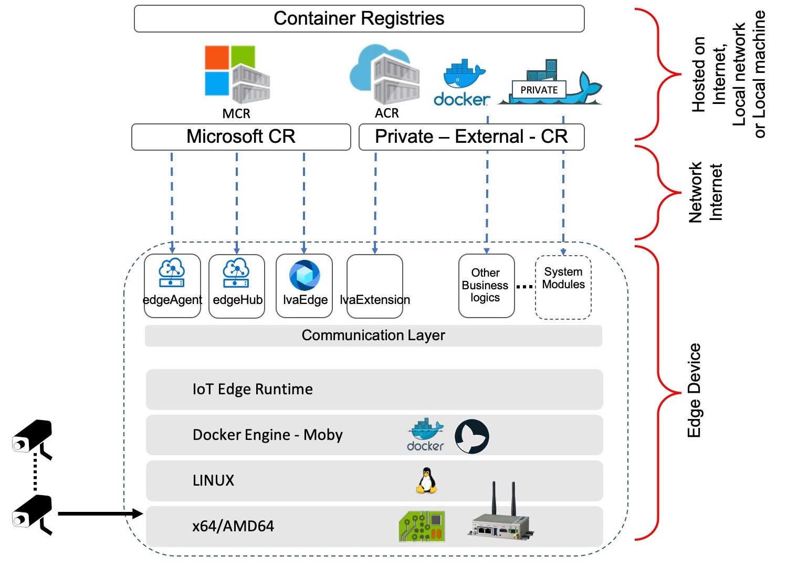
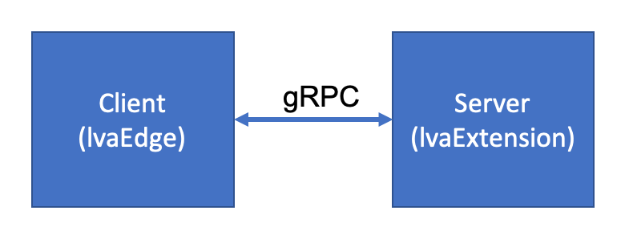
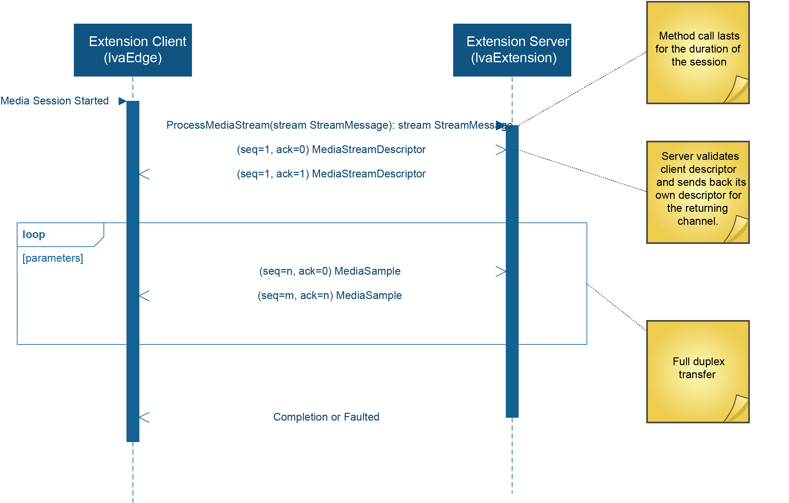

# LVA YOLOv3 iCPU ONNX Sample with gRPC extension on Jupyter Notebooks 
gRPC is a language-neutral, platform-neutral RPC framework that is quickly taking on JSON/HTTP as the recommended way to communicate between microservices. 

gRPC helps with:  
* Communication based on HTTP2 transport  
* Well-defined schemas via Protocol Buffers 3  
* Bi-directional streaming  

By default, gRPC uses Protocol Buffers and as its underlying message interchange format for communication.

> [!NOTE] 
> References to third-party software in this repo are for informational and convenience purposes only. Microsoft does not endorse nor provide rights for the third-party software. For more information on third-party software please see the links provided above.

The following Jupyter notebook instructions will enable you to run an [ONNX](http://onnx.ai/) based [YOLOv3](http://pjreddie.com/darknet/yolo/) model on **Live Video Analytics (LVA) with gRPC extension**.  

The image below summarizes the deployment scheme of LVA. As the image indicates, LVA can utilize containers hosted on the Internet, on a local network, or even on a local machine.  

  

The modules named **lvaEdge** and **lvaExtension** in the LVA ecosystem can communicate using the gRPC protocol.  
  

The diagram below shows the gRPC message flow between these two modules.  
  

> [!TIP]
> For this sample, we have already compiled the proto files (Protocol Buffers) to be used for communicating between LVA and the lvaExtension module. You can find the un-compiled gRPC proto files that were used [here](../../../../../grpc-proto-files/).

## Prerequisites
> **1. Install Visual Studio Code**  

We recommend using Visual Studio Code (VSCode) as it has extensions for running and managing Jupyter notebooks and IoT devices as well. If you do not already have it installed, please follow the [instructions to install Visual Studio Code](https://code.visualstudio.com/docs/setup/setup-overview).  

> **2. Clone this repository**  

[Clone this repository](/../../) locally into your development PC and open the repository with VSCode. 

> **3. Locate this readme file in VSCode**

> [!NOTE] 
> Going forward, we will be using VSCode to run this sample. Please navigate to VSCode and continue. 

In VSCode, locate this Readme page and continue reading there. You can preview Markdown (`.md`) pages by pressing `Ctrl+Shift+V` to open a full-screen window or by clicking the preview button on the top toolbar in VSCode. For pictures to render on VSCode, you must have the entire [live-video-analytics](/../..) folder open in your VSCode workspace. 
   
    

> **4. Install the requirements**

Install the [requirements for running LVA on Jupyter](../../../common/requirements.md) on your development PC.

## Getting Started
> **5. Set up the common environment**  

In VSCode, [set up the environment](../../../common/setup_environment.ipynb) so that you can test and deploy LVA.  

> [!NOTE]
> Jupyter notebooks (`.ipynb`) may take several seconds to render in VSCode. Please be patient.

> **6. Set up the sample specific environment**  

As this sample requires some specific settings, [set up the sample specific environment](setup_specific_environment.ipynb).

> **7. Create Azure Services**  

Create the required [Azure services](../../../common/create_azure_services.ipynb).

> **8. Create Azure VM as IoT Edge device**  

You will need an IoT Edge device to deploy the LVA and this sample generated containers. If you don't have a physical IoT Edge device, create an [Azure virtual machine](../../../common/create_azure_vm.ipynb).

> **9. Install IoT Edge Runtime on IoT Edge device**  

[Install IoT Edge runtime](../../../common/install_iotedge_runtime_cpu.md) on the Edge device. 

## Build a Docker Container Image of the Inference Server Solution
The following sections will explain how to build a Docker container image of an inference server solution that uses AI logic (i.e., YOLOv3 for object detection) on a **CPU accelerated IoT Edge Device**.

> **10. Containerize inference engine solution**  

[Create a Docker container image](create_yolov3_grpc_icpu_container_image.ipynb) by containerizing the YOLOv3 gRPC inference engine server solution. At the end of this step you will have a Docker container image on your development PC named **lvaextension:grpc.yolov3.v1**.

> **11. Upload container image to ACR**

[Upload the container image](../../../common/upload_container_image_to_acr.ipynb) to your Azure Container Registry (ACR). This will make it accessible by any permitted IoT Edge device.

## Deploy the LVA Extension and LVA Modules
The following sections will let you deploy your LVA module (lvaEdge) and the LVA Extension module (lvaExtension).

> **12. Create deployment manifest file**  

[Update the deployment manifest template file](create_deployment_manifest.ipynb) to create a custom deployment template that is specific to this sample.

> **13. Deploy the lvaEdge and lvaExtension modules**  

[Deploy the modules](../../../common/deploy_iotedge_modules.ipynb) to an IoT Edge device using the deployment manifest. 

## Deploy Media Graph and Test LVA

> **14. Deploy media graph**

[Deploy a media graph](../../../common/deploy_media_graph.ipynb) to trigger the inference server.

> **15. Monitor the output**  

[Monitor the output](../../../common/monitor_output.md) of the inference server and test to see if it works as desired.

If you had assets created, follow these instructions to [view those assets](../../../common/asset_playback.md).

> **16. Deactivate and delete media graph**  

Lastly, [deactivate and delete](../../../common/delete_media_graph.ipynb) the media graph to stop the inferences.

## Summary

We provide several notebooks and documents that help in running the YOLOv3 ONNX model on Live Video Analytics:

| Notebook or Document Name                                                                    | Description                                                                                              |
| -------------------------------------------------------------------------------------------- | ---------------------------------------------------------------------------------------------------------|
| [requirements.md](../../../common/requirements.md)                                           | Document that will help you install tools for getting started with this sample                           |
| [setup_environment.ipynb](../../../common/setup_environment.ipynb)                           | Notebook that will help set up the environment so that we can test and deploy LVA                        |
| [setup_specific_environment.ipynb](setup_specific_environment.ipynb)                         | Notebook that will help set up a specific environment for this sample                                    |
| [create_azure_services.ipynb](../../../common/create_azure_services.ipynb)                   | Notebook that will help create the required Azure resources                                              |
| [create_azure_vm.ipynb](../../../common/create_azure_vm.ipynb)                               | Notebook that will help choose and configure a virtual machine that will act as the IoT Edge device      |
| [install_iotedge_runtime_cpu.md](../../../common/install_iotedge_runtime_cpu.md)             | Document that will help install IoT Edge runtime and other tools on your IoT Edge device                 |
| [create_yolov3_grpc_icpu_container_image.ipynb](create_yolov3_grpc_icpu_container_image.ipynb)| Notebook that will help create a Docker container image from an ML solution                              |
| [upload_container_image_to_acr.ipynb](../../../common/upload_container_image_to_acr.ipynb)   | Notebook that will help upload your local container to Azure Container Registry (ACR)                    |
| [create_deployment_manifest.ipynb](create_deployment_manifest.ipynb)                         | Notebook that will help create a custom deployment manifest file by updating a template                  |
| [deploy_iotedge_modules.ipynb](../../../common/deploy_iotedge_modules.ipynb)                 | Notebook that will help deploy the lvaEdge and lvaExtension modules                                      |
| [deploy_media_graph.ipynb](../../../common/deploy_media_graph.ipynb)                         | Notebook that will help deploy a media graph to your IoT Edge device to activate inference capabilities  |
| [monitor_output.md](../../../common/monitor_output.md)                                       | Document that will help you monitor the output of LVA                                                    |
| [asset_playback.md](../../../common/asset_playback.md)                                       | Document that will help you play back inference outputs on Azure Media Services                          |
| [delete_media_graph.ipynb](../../../common/delete_media_graph.ipynb)                         | Notebook thatt will help you deactivate and delete the media graph                                       |