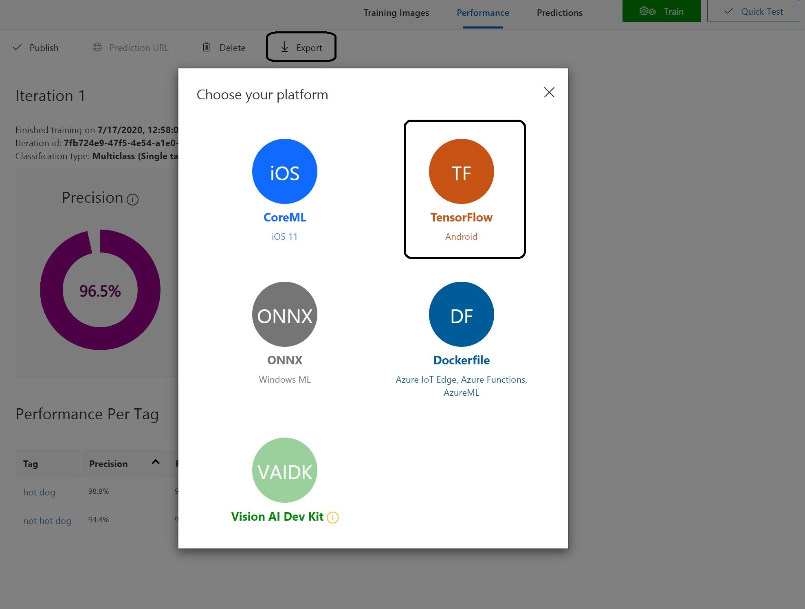

# LVA Custom Vision Sample on Jupyter Notebooks 
In this sample, you will learn how to build a containerized model that can detect a toy truck with [Azure Custom Vision](https://azure.microsoft.com/en-us/services/cognitive-services/custom-vision-service/) and use Live Video Analytics to detect and infer toy trucks from a live video stream. 

The image below summarizes the deployment scheme of LVA. As the image indicates, LVA can utilize containers hosted on the Internet, on a local network, or even on a local machine.  

  

## Prerequisites
> **1. Install Visual Studio Code**  

We recommend using Visual Studio Code (VSCode) as it has extensions for running and managing Jupyter notebooks and IoT devices as well. If you do not already have it installed, please follow the [instructions to install Visual Studio Code](https://code.visualstudio.com/docs/setup/setup-overview).  

> **2. Clone this repository**  

[Clone this repository](/../../) locally into your development PC and open the repository with VSCode. 

> **3. Locate this readme file in VSCode**

> [!NOTE] 
> Going forward, we will be using VSCode to run this sample. Please navigate to VSCode and continue. 

In VSCode, locate this Readme page and continue reading there. You can preview Markdown (`.md`) pages by pressing `Ctrl+Shift+V` to open a full-screen window or by clicking the preview button on the top toolbar in VSCode. For pictures to render on VSCode, you must have the entire [live-video-analytics](/../..) folder open in your VSCode workspace. 
      
    
    

> **4. Install the requirements**

Install the [requirements for running LVA on Jupyter](../common/requirements.md) on your development PC.

## Getting Started
> **5. Set up the common environment**  

In VSCode, [set up the environment](../common/setup_environment.ipynb) so that you can test and deploy LVA.  

> [!NOTE]
> Jupyter notebooks (`.ipynb`) may take several seconds to render in VSCode. Please be patient.

> **6. Set up the sample specific environment**  

As this sample requires some specific settings, [set up the sample specific environment](setup_specific_environment.ipynb).

> **7. Create Azure Services**  

Create the required [Azure services](../common/create_azure_services.ipynb).

> **8. Create Azure VM as IoT Edge device**  

You will need an IoT Edge device to deploy the LVA and this sample generated containers. If you don't have a physical IoT Edge device, create an [Azure virtual machine](../common/create_azure_vm.ipynb).

> **9. Install IoT Edge Runtime on IoT Edge device**  

[Install IoT Edge runtime](../common/install_iotedge_runtime_cpu.md) on the Edge device. 

## Use Custom Vision to Build Inference Solution 
The following sections will explain how to use Custom Vision to build an inference solution that detects toy trucks.

> **10. Create Custom Vision model**

In order to build a toy truck detector, follow this [Custom Vision quickstart tutorial](https://docs.microsoft.com/en-us/azure/cognitive-services/custom-vision-service/get-started-build-detector).

* For this tutorial, please do not use the sample images provided in the prerequisite section. Instead, we have leveraged an [image set](https://lvamedia.blob.core.windows.net/public/ToyCarTrainingImages.zip) to build a toy detector.
* In the project settings, be sure to select "Object Detection" for the project type and "General (compact)" for the domain.
* In the tagging image section of the tutorial, please ensure that you are tagging the toy truck seen in the picture with the tag "delivery truck".

> **11. Export model as TensorFlow**

Once finished, you can export it as TensorFlow using the Export button in the Performance tab. 

  

> **12. Move files into `lvaextension` folder**

Unzip the downloaded folder and move labels.txt and model.pb into the `lvaextension` folder (live-video-analytics/utilities/video-analysis/notebooks/customvision/lvaextension).

> [!NOTE]
> In the lvaextension folder, we manually added object_detection.py. This was one of the files included in the exported TensorFlow folder, with minor modifications for LVA (starting from line 167). 

## Build a Docker Image of the Inference Server - LVA Extension
The following sections will explain how to build a Docker container image of an inference server solution that uses AI logic (i.e., YOLOv3 for object detection) on a **CPU accelerated IoT Edge Device**.

> **13. Create an inference engine**  

Create an [inference engine](create_custom_vision_inference_engine.ipynb) using your TensorFlow files. The inference engine wrapper will retrieve image data, analyze it, and return the analysis as output.
   
> [!NOTE]
> In our score.py, we copied over some of the code from predict.py, which was located in the exported TensorFlow folder, and made some minor modifications to the variable names. 

> **14. Containerize inference engine solution**  

[Create a Docker image](create_custom_vision_container_image.ipynb) to containerize the inference solution. The inference solution consists of a web application and an inference server.

Optional: [Test the Docker image locally](local_test_custom_vision.ipynb) before uploading it to a container registry. 

> **15. Upload container image to ACR**

[Upload the container image](../common/upload_container_image_to_acr.ipynb) to your Azure Container Registry (ACR). This will make it accessible by any permitted IoT Edge device.

## Deploy the LVA Extension and LVA Modules
The following sections will let you deploy your LVA module (lvaEdge) and the LVA Extension module (lvaExtension).

> **16. Deploy the lvaEdge and lvaExtension modules**  

[Deploy the modules](deploy_iotedge_modules.ipynb) to an IoT Edge device using the pre-built deployment manifest template named [deployment.common.template.json](../common/deployment.common.template.json).

## Deploy Media Graphs and Test LVA

> **17. Deploy media graph**

[Deploy a media graph](../common/deploy_media_graph.ipynb) to trigger the inference server.

> **18. Monitor the output**  

[Monitor the output](../common/monitor_output.md) of the inference server and test to see if it works as desired.

If you had assets created, follow these instructions to [view those assets](../common/asset_playback.md).

> **19. Deactivate and delete media graph**  

Lastly, [deactivate and delete](../common/delete_media_graph.ipynb) the media graph to stop the inferences.

## Summary

We provide several notebooks and documents that help in running your Custom Vision model on Live Video Analytics:

| Notebook or Document Name                                                                  | Description                                                                                              |
| ------------------------------------------------------------------------------------------ | ---------------------------------------------------------------------------------------------------------|
| [requirements.md](../common/requirements.md)                                               | Document that will help you install tools for getting started with this sample                           |
| [setup_environment.ipynb](../common/setup_environment.ipynb)                               | Notebook that will help set up the environment so that we can test and deploy LVA                        |
| [setup_specific_environment.ipynb](setup_specific_environment.ipynb)                       | Notebook that will help set up a specific environment for this sample                                    |
| [create_azure_services.ipynb](../common/create_azure_services.ipynb)                       | Notebook that will help create the required Azure resources                                              |
| [create_azure_vm.ipynb](../common/create_azure_vm.ipynb)                                   | Notebook that will help choose and configure a virtual machine that will act as the IoT Edge device      |
| [install_iotedge_runtime_cpu.md](../common/install_iotedge_runtime_cpu.md)                 | Document that will help install IoT Edge runtime and other tools on your IoT Edge device                 |
| [create_custom_vision_inference_engine.ipynb](create_custom_vision_inference_engine.ipynb) | Notebook that will help create an inference engine based on the Custom Vision ML model                   |
| [create_custom_vision_container_image.ipynb](create_custom_vision_container_image.ipynb)   | Notebook that will help create a Docker container image from the Custom Vision ML model                  |
| [upload_container_image_to_acr.ipynb](../common/upload_container_image_to_acr.ipynb)       | Notebook that will help upload your local container to Azure Container Registry (ACR)                    |
| [local_test_custom_vision.ipynb](local_test_custom_vision.ipynb)                           | Notebook that will help test the Docker image locally before uploading onto a container registry         |
| [deploy_iotedge_modules.ipynb](deploy_iotedge_modules.ipynb)                     | Notebook that will help deploy the lvaEdge and lvaExtension modules                                      |
| [deploy_media_graph.ipynb](../common/deploy_media_graph.ipynb)                             | Notebook that will help deploy a media graph to your IoT Edge device to activate inference capabilities  |
| [monitor_output.md](../common/monitor_output.md)                                           | Document that will help you monitor the output of LVA                                                    |
| [asset_playback.md](../common/asset_playback.md)                                           | Document that will help you play back inference outputs on Azure Media Services                          |
| [delete_media_graph.ipynb](../common/delete_media_graph.ipynb)                             | Notebook thatt will help you deactivate and delete the media graph                                       |

